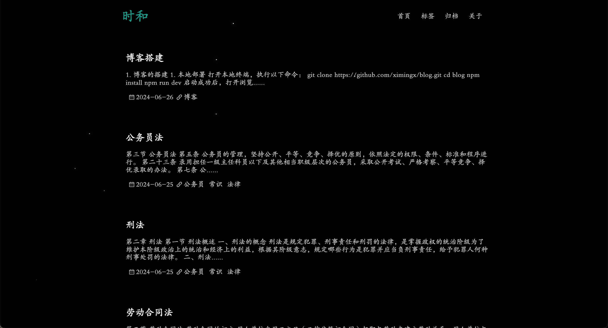
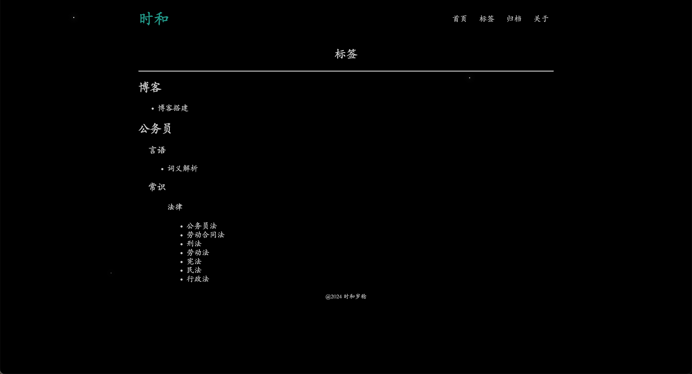
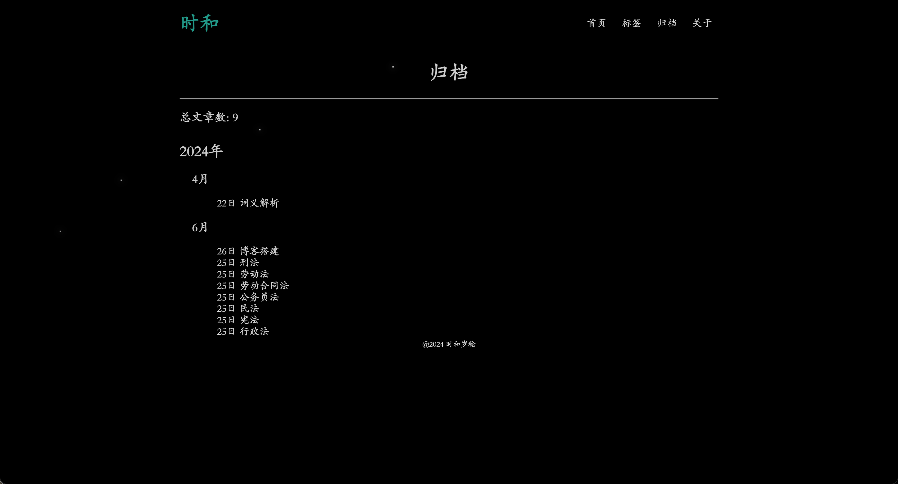
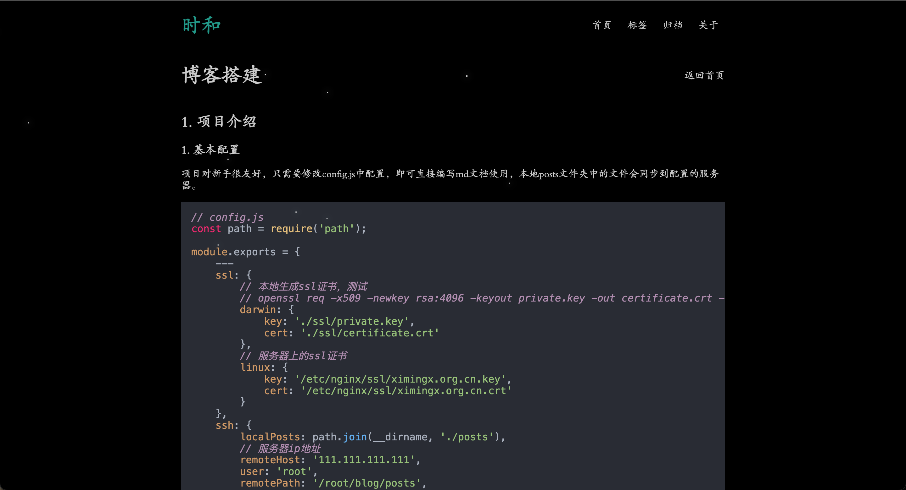

## 1. 项目介绍

项目演示地址：https://ximingx.org.cn/

项目github：https://github.com/ximingx/blog

想象一下，你是一位热爱写作的程序员小王。每天，你都有很多新的想法和技术心得想要分享。但是，管理你的博客网站却成了一个让你头疼的问题。

周一早晨，你坐在电脑前，准备写一篇关于最新学到的编程技巧的博客文章。然而，你突然想到还要登录到博客管理后台，配置文章类别，调整发布时间，上传图片，等等。这些繁琐的步骤让你感到沮丧，你意识到要花费至少半小时来处理这些技术细节，而不是专注于写作本身。

你心想:"要是我能只管写作，其他的事情都自动完成就好了。我只想用Markdown写下我的想法，然后它们就神奇地出现在我的博客上，那该多好啊!"

这时这个博客系统允许你只需在本地编写Markdown文档，就能自动将内容上传到服务器并发布到你的博客上。有了这个工具，你可以随时随地打开你喜欢的文本编辑器，用Markdown格式写下你的想法。完成后，你只需保存文件，剩下的一切都会自动完成。这样，你就可以将更多的时间和精力投入到真正重要的事情上:分享你的知识和经验。

### 1. 使用案例

如下是项目目录，你创建一些md文档与目录

```javascript
posts
├── assets
│   └── image-20240626085241624.png
├── 公务员
│   ├── 常识
│   │   └── 法律
│   │       ├── 公务员法.md
│   │       ├── 刑法.md
│   │       ├── 劳动合同法.md
│   │       ├── 劳动法.md
│   │       ├── 宪法.md
│   │       ├── 民法.md
│   │       └── 行政法.md
│   └── 言语
│       └── 词义解析.md
└── 博客
    └── 博客搭建.md
```

博客文章存放在 `blog/posts` 目录下，posts 目录下的每一个文件夹即为分类，文件夹下的 `.md` 文件即为文章。

- 文件夹代表文章的标签
- 文件的名字为文章标题
- 文件的修改时间为归档时间
- posts下的assets存放md文档的照片

首页面显示：



显示的标签：



显示的归档：



文章的样式：



修改项目根目录下的README.md即可直接修改关于页面。

这似乎是一个很平常的博客系统，但是我们可以做一些配置，同步到我们的服务器上，让我们不需要做额外的操作，它自动完成文件的上传。

### 2. 项目基本配置

项目对新手很友好，只需要修改config.js中配置，即可直接编写md文档使用，在设置ssh后本地posts文件夹中的文件会同步到配置的服务器。

```js
// config.js
const path = require('path');

module.exports = {
    ---
    ssl: {
        // 本地生成ssl证书，测试
        // openssl req -x509 -newkey rsa:4096 -keyout private.key -out certificate.crt -days 365
        darwin: {
            key: './ssl/private.key',
            cert: './ssl/certificate.crt'
        },
        // 服务器上的ssl证书
        linux: {
            key: '/etc/nginx/ssl/ximingx.org.cn.key',
            cert: '/etc/nginx/ssl/ximingx.org.cn.crt'
        }
    },
    ssh: {
        localPosts: path.join(__dirname, './posts'),
        // 服务器ip地址
        remoteHost: '0.0.0.0', //不设置，默认不启动服务器
        user: 'root',
        remotePath: '/root/blog/posts',
        // 需要与服务器配置好ssh免密登录
        privateKey: '/Users/ximingx/.ssh/id_rsa'
    },
    ---
};
```

## 2. 博客的搭建

### 1. 本地部署

打开本地终端，执行以下命令：

```bash
git clone https://github.com/ximingx/blog.git
cd blog
npm install
npm run dev
```

启动成功后，打开浏览器，访问 `https://localhost` 即可查看博客。

### 2. 服务器部署

CentOS系统上安装Node.js和npm 

```bash
curl -sL https://rpm.nodesource.com/setup_14.x | sudo bash - sudo yum install -y nodejs
```

使用 zip 和 unzip 命令来压缩和解压缩文件。

```bash
# 本地操作
# 压缩blog
zip -r blog.zip ./blog
# 复制本地文件到服务器
scp /Users/ximingx/Downloads/blog.zip root@服务器ip地址:/root  #然后输入自己的秘密

# 进入服务器
ssh -p 22 username@remotehost

# 进入到服务器后
unzip blog.zip
# 进入项目
cd blog 
# 安装依赖，启动项目
npm i
pm2 start app.js
# 设置PM2开机自启
pm2 startup systemd
# 保存当前的PM2进程列表，确保重启后能恢复：
pm2 save

# 补充
# sudo rm -r /path/to/your/directory 可以用来删除文件夹目录
```

